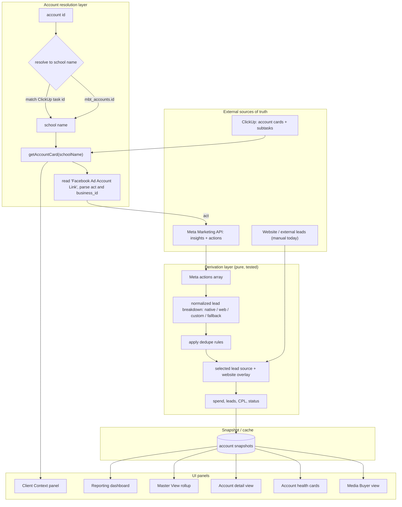

# MBT Dashboard — Fresh Build Specification

**Audience:** an AI coding agent (and any human reviewing it) tasked with building
the Media Buyer Tool (MBT) **from scratch**, replacing the current codebase.
**Status of this doc:** authoritative requirements + architecture. Where the
current code does something specific, it is captured so the rebuild keeps the
behavior on purpose rather than by accident.
**Target stack:** Next.js (App Router) + React + TypeScript. Postgres for
persistence. Server-side calls to the Meta Marketing API and the ClickUp API.

---

## 0. Why we are rebuilding

The existing MBT works but has been reshaped many times; logic is tangled across
routes and the data flow is hard to reason about. This spec exists so the new
build starts clean with the **same proven behavior** but a deliberate structure.

Guiding principles for the rebuild:

1. **One source of truth for account → ad-account mapping.** The ClickUp account
   card's *Facebook Ad Account Link* is authoritative. Do not introduce a
   competing hardcoded FB-account table that can drift.
2. **Lead counting is the crown jewel.** The normalization/dedupe logic (Section 4)
   is the single most error-prone part of the product. Build it as one pure,
   unit-tested module that everything else calls — never inline this math in a route.
3. **Separate three layers cleanly:** (a) external data (Meta, ClickUp),
   (b) normalization/derivation, (c) UI + dashboard-only overlays. Overlays
   (campaign filters, manual website-lead counts) must never leak into the
   fetch/normalize layers.
4. **Cache deliberately.** Meta and ClickUp are rate-limited and slow. Snapshot
   results so the UI reads from a cache, not from live calls on every render.

---

## 1. One-sentence architecture

> The MBT dashboard is a **ClickUp-driven client shell** wrapped around **Meta
> Marketing API performance data**, with **dashboard-only overlays** for campaign
> filtering and website-lead adjustments.

---

## 2. System map



---

## 3. The authoritative join: ClickUp → Facebook ad account

This is the **key join** in the whole system. Get it right and everything
downstream is reliable.

### 3.1 Resolution flow
1. The UI holds an **account id**.
2. Resolve that id to a **school name**:
   - first by direct `mbt_accounts.id`,
   - else by matching a **ClickUp task id**.
3. Call `clickUpClient.getAccountCard(schoolName)`.

### 3.2 Reading the ad account
- The ClickUp account card has a custom field: **`Facebook Ad Account Link`**.
- That field holds a URL with query params:
  - `act=<facebook_ad_account_id>` → the actual ad account id used for all Meta calls.
  - `business_id=<business_id>` → stored as context (optional).
- Parse `act`, normalize to `act_<id>`, and call
  `facebookClient.getAccountInsights(act, 'this_month')`.

### 3.3 Where this pattern is reused
The same ClickUp-link → `act` extraction must back **every** place that needs an
ad account, not just the detail page:
- `getAccountDetail()`
- `clickup-lookup`
- account campaigns route
- sync route logic

**Acceptance criteria**
- Given a ClickUp card with a valid `Facebook Ad Account Link`, the system derives
  the correct `act_<id>` and never falls back to a stale local table.
- If the link is missing or unparseable, the account renders in a clearly-flagged
  "no ad account linked" state instead of silently showing zeros.

### 3.4 Context fields: ClickUp is canonical (field sync direction)

Client-context fields — **Current Offer, Current Audience, Program, Pod, Media
Buyer, CAP/GBA Agents, Status, Location, Total Budget, Creative Restrictions** —
must have **one home: the ClickUp account card.** Today the reporting workbook
keeps separate copies (an `Offers` tab, dropdown lists in `Sheet6`), which is
exactly how "the offer says one thing here and another there" happens. Kill the
duplicates and read these fields from ClickUp.

**Default = one-way, ClickUp → dashboard (read-through).**
- On each sync, pull these fields from the account card into a context mirror and
  display them. The dashboard never silently owns them, so context is never lost
  and never drifts — ClickUp is the single source of truth.

**Editing them = controlled write-back (optional, per field).**
- If an MB needs to change, say, the Current Offer from inside the dashboard, the
  save writes **back to the ClickUp custom field via the API**, then re-reads.
  ClickUp stays canonical; the dashboard is just another window onto it.
- Enable write-back only for the specific fields you want editable in-app;
  everything else is a read-only mirror.

**On true background two-way sync — recommended *against*.**
- It's technically possible (the ClickUp API reads and writes both ways on a
  timer), but continuous bidirectional sync creates **conflict-resolution**
  problems: if the card and the dashboard both change between syncs, which wins?
  That ambiguity is precisely how context gets silently clobbered — the thing
  you're trying to avoid.
- Read-through + explicit write-back gives the same practical result ("edit in
  either place, stays consistent everywhere") **without** a background merge war.
  This is the recommended pattern.

**Acceptance criteria**
- No offer/audience/program value is stored as an independent editable copy; the
  authoritative value always resolves to the ClickUp card.
- A dashboard edit to a write-back-enabled field updates ClickUp and shows on the
  card; a non-enabled field is read-only in the dashboard.
- The standalone `Offers` / `Sheet6` lists are **not** recreated.

---

## 4. Meta insights + lead normalization (the crown jewel)

Build this as one pure module (recommended `src/lib/leads.ts`) that takes a raw
Meta insights row and returns a normalized breakdown. **No route should compute
this inline.**

### 4.1 What we request from Meta
For each ad account, pull insights with fields:
- `spend`
- `impressions`
- `clicks`
- `actions`

Pull at **account level** by default; support **campaign-level** insights when the
campaign selector (Section 6.5) needs a filtered rollup. Use `act_<id>`.

### 4.2 Action types, grouped by lead source

**Meta native leads (Meta lead forms)**
- `offsite_complete_registration_add_meta_leads`
- `onsite_conversion.lead_grouped`

**Pixel / web / registration events (Conversion events)**
- `offsite_conversion.fb_pixel_lead`
- `offsite_complete_registration`
- `complete_registration`
- `onsite_web_lead`

**Custom conversions**
- `offsite_conversion.custom.<custom_conversion_id>`

**Fallback rollup**
- `lead`

### 4.3 Dedupe rules (do not double count)
These rules are intentional and must be preserved:

1. **Meta native pair = same thing.** Treat
   `offsite_complete_registration_add_meta_leads` and
   `onsite_conversion.lead_grouped` as two names for the same event and take the
   **max**, not the sum.
2. **`onsite_web_lead` and `fb_pixel_lead` overlap.** They are overlapping
   representations of web leads — **do not blindly sum both**. (Take the max /
   treat as one bucket.)
3. **Never stack the generic `lead` rollup on top of specific events.** `lead` is
   a fallback only, used when no specific event is present.

### 4.4 Suggested algorithm
```
function normalizeLeads(actions, mode, selectedEvents?):
    map = index actions by action_type -> number

    nativeLeads = max(
        map['offsite_complete_registration_add_meta_leads'],
        map['onsite_conversion.lead_grouped']
    )

    webLeads = max(
        map['offsite_conversion.fb_pixel_lead'],
        map['onsite_web_lead']
    )
    registration = max(
        map['offsite_complete_registration'],
        map['complete_registration']
    )

    customLeads = sum of map['offsite_conversion.custom.<id>'] for selected ids

    fallback = map['lead']   // only if nothing specific is present

    switch mode:
        'meta'        -> nativeLeads
        'conversions' -> sum of the *selected* conversion events
                         (webLeads / registration / specific customs),
                         de-duped per rules above; fall back to `lead`
                         only if no specific events resolved
        'external_web'-> website overlay only (Section 5)

    return { nativeLeads, webLeads, registration, customLeads, fallback, total }
```

### 4.5 CPL + status (the "WTF metric")
- `CPL = spend / total_leads` (guard divide-by-zero → null/"—").
- **Status is an absolute CPL scale** (the team's "WTF metric"), **not** relative
  to a per-account target:

  | Status | CPL ($) |
  |---|---|
  | 🟢 Green  | under 20 |
  | 🟡 Yellow | 20.00 – 24.99 |
  | 🟠 Orange | 25.00 – 29.99 |
  | 🔴 Red    | 30.00 – 59.99 |
  | 🆘 WTF    | 60.00 and over |

- **Computed CPL status is authoritative.** The ClickUp *Media Buying Health*
  field is shown for context but is **overridden** by the computed CPL status.
- Spend with **zero leads** → treat as WTF (worst band), not "—".
- **WTF % (per Media Buyer)** = accounts with CPL ≥ 60 ÷ that MB's total accounts.
  **Sub-WTFs** = total accounts − WTFs. (These drive the Master View, 6.9.)
- For **reporting histograms**, the green band is shown split for detail —
  **Under $10** and **$10–19.99** — but the status colors above are unchanged.
- **Account lifecycle Status** (distinct from CPL status) comes from ClickUp:
  *Active · Client Connect · Cancelling · Cancelled*.

**Acceptance criteria**
- Unit tests cover: native-pair max, web/pixel overlap, fallback suppression,
  custom-conversion selection, and zero-spend/zero-lead guards.
- Switching lead source in the UI changes only which bucket is summed — the raw
  fetched data is identical.

---

## 5. Lead data source toggle + website leads overlay

### 5.1 Modes (from `LeadSettingsModal`)
- **Meta Leads** (`meta`) — Meta native lead forms.
- **Conversion Events** (`conversions`) — pixel / web / registration / custom.
  When selected, the UI shows a **picker of specific event types**, including
  custom conversions. Friendly names for customs load from:
  `GET /api/mbt/ad-builder?action=custom-conversions&fbAdAccountId=act_<id>`
- **Market Muscle / external web leads** (`external_web`) — see 5.3.

### 5.2 Website leads overlay (works today, keep it)
A **manual** overlay on the account detail page:
- toggle website leads on,
- enter a **monthly count**,
- it syncs into dashboard math, **added on top of Facebook leads** for total CPL.

### 5.3 Market Muscle — live ingestion (in scope for this build)
- Today's code only has the *concept*: the `external_web` mode plus
  `market_muscle_config` storage. **This build implements real ingestion.**
- Build a `src/lib/market-muscle.ts` client that pulls external web-lead counts
  per account on the same sync cadence as Meta, writes them into the daily tables,
  and feeds the `external_web` lead source.
- The manual monthly-count overlay (5.2) stays as a **fallback** for accounts not
  yet wired to Market Muscle, and as a manual override when ingestion is unavailable.
- **Needs from you (data, not design):** Market Muscle API base URL, auth method,
  and the per-account identifier that maps a Market Muscle account → `mbt_accounts.id`.

**Acceptance criteria**
- Total leads = (selected Meta/conversion bucket) + (Market Muscle ingest **or**
  manual website overlay).
- Ingested vs manual web leads are visually distinguishable, and ingestion failure
  falls back to the manual count rather than dropping to zero.

---

## 6. Modules / views

Each is a module with a clear responsibility. All read from the **snapshot/cache**,
not from live Meta/ClickUp on every render.

### 6.1 Media Buyer view (by individual MB)
- Filter the portfolio to a single Media Buyer (from ClickUp *Assigned Media Buyer*).
- Show that MB's accounts as health cards (6.2), plus simple roll-up totals
  (total spend, total leads, blended CPL).

### 6.2 Account health cards
- Per account: **spend, leads, CPL, status** chip.
- Status color per Section 4.5. Card links into the account detail view.

### 6.3 Account detail view (per client)
- The merge point: **Meta performance + ClickUp context + dashboard-only state**
  (campaign filters, website-lead overlay).
- Hosts the lead-source toggle (Section 5), campaign selector (6.5), and the
  Client Context panel (6.4).

### 6.4 Client Context panel (from ClickUp)
Driven by `/api/mbt/accounts/[id]/clickup`, `clickup-client.ts`, `ClientContext.tsx`.
`getAccountCard()` loads active portfolio account cards, finds the match, fetches
subtasks, and extracts:

- Account/School Name, **Status (lifecycle)**, **Pod**, Assigned Media Buyer,
  Client Name, Location, Program(s), **CAP Agent**, **GBA Agent**,
  **Current Audience**, Current Offer, **Automation Notes**, Creative Restrictions,
  Media Buying Health, Point of Contact, **Total Budget**, Styles Taught,
  Program Advertised, School Website, Facebook Page Link, Google Drive Link,
  Address, Zip codes / exclusions.

> These are the **canonical context fields** (Section 3.4), shown across the health
> cards, account detail, and the reporting dashboard. They live on the ClickUp
> card — not in a separate offers list. (Bolded fields are the ones the current
> reporting workbook duplicates and we are consolidating into ClickUp.)

Related subtasks: **Media Buyer Management**, **Client Comms Tracking**.

The panel renders: main ClickUp card link, MB Management link, health, assigned MB,
current offer, budget, active programs, restrictions, historical actions.

### 6.5 Campaign selector
- List the account's campaigns (campaign-level Meta insights).
- Let the user **include/exclude** campaigns from the account rollup.
- This is **dashboard-only state** — it re-filters which campaign rows feed the
  normalization, it does not change anything in Meta.

### 6.6 Copy Audit
Review an account's ad copy against two checks:
- **Offer accuracy** — copy matches the **Current Offer** on the ClickUp card.
- **Seasonal / theme accuracy** — copy matches the season/theme that's active *for
  today's date*, derived from a built-in **US + Canada seasonal calendar** (no
  manual input). Flag copy that references a theme whose window has already passed
  (e.g., a "summer" promo running in October) or is far in the future.

**How the seasonal check works**
1. From today's date, compute the **active themes** from `src/config/seasonal-calendar.ts`
   (a tunable config — see below).
2. Detect any seasonal/holiday reference in the ad copy (keyword match against the
   calendar's terms; LLM-assisted classification is fine as a backstop).
3. Decide:
   - **Pass** — copy is evergreen (no seasonal reference), or its reference matches
     an active window (or one opening within the lead-in buffer).
   - **Flag** — copy references a theme whose window has **passed** (beyond the
     grace buffer) or is **out of season**. Include the reason and the current
     active theme so the MB can fix or dismiss.

**Seasonal calendar config (starter — US + Canada, tunable)**
```ts
// src/config/seasonal-calendar.ts
// region: 'US' | 'CA' | 'both'. Dates are month/day; engine adds the year.
// leadInDays = how early copy may reference it; graceDays = how late before stale.
export const SEASONAL_CALENDAR = [
  { theme: 'New Year / New You',     start: '12-26', end: '01-31', region: 'both', terms: ['new year','resolution','fresh start','new you'] },
  { theme: 'Valentine\'s Day',       start: '01-25', end: '02-14', region: 'both', terms: ['valentine','sweetheart','love'] },
  { theme: 'Spring Kickoff',         start: '03-01', end: '04-15', region: 'both', terms: ['spring','spring into'] },
  { theme: 'Easter',                 start: '03-10', end: '04-20', region: 'both', terms: ['easter','egg hunt'] },
  { theme: 'March Break (CA)',       start: '03-08', end: '03-22', region: 'CA',   terms: ['march break'] },
  { theme: 'Spring Break (US)',      start: '03-01', end: '03-31', region: 'US',   terms: ['spring break'] },
  { theme: 'Mother\'s Day',          start: '04-25', end: '05-11', region: 'both', terms: ['mother','mom','mum'] },
  { theme: 'Victoria Day (CA)',      start: '05-12', end: '05-19', region: 'CA',   terms: ['victoria day'] },
  { theme: 'Memorial Day (US)',      start: '05-20', end: '05-26', region: 'US',   terms: ['memorial day'] },
  { theme: 'Summer Kickoff / Camps', start: '05-15', end: '07-15', region: 'both', terms: ['summer','summer camp','camp'] },
  { theme: 'Father\'s Day',          start: '06-05', end: '06-15', region: 'both', terms: ['father','dad'] },
  { theme: 'Graduation',             start: '05-15', end: '06-30', region: 'both', terms: ['grad','graduation'] },
  { theme: 'Canada Day (CA)',        start: '06-24', end: '07-01', region: 'CA',   terms: ['canada day'] },
  { theme: 'Independence Day (US)',  start: '06-28', end: '07-04', region: 'US',   terms: ['july 4','independence day','4th of july'] },
  { theme: 'Back to School',         start: '07-25', end: '09-15', region: 'both', terms: ['back to school','new school year','fall classes'] },
  { theme: 'Labour / Labor Day',     start: '08-25', end: '09-02', region: 'both', terms: ['labor day','labour day'] },
  { theme: 'Fall Kickoff',           start: '09-15', end: '10-31', region: 'both', terms: ['fall','autumn'] },
  { theme: 'Thanksgiving (CA)',      start: '09-28', end: '10-13', region: 'CA',   terms: ['thanksgiving'] },
  { theme: 'Halloween',              start: '10-01', end: '10-31', region: 'both', terms: ['halloween','spooky','trick or treat'] },
  { theme: 'Thanksgiving (US)',      start: '11-15', end: '11-27', region: 'US',   terms: ['thanksgiving','turkey'] },
  { theme: 'Black Friday / Cyber',   start: '11-20', end: '12-02', region: 'both', terms: ['black friday','cyber monday','doorbuster'] },
  { theme: 'Holiday Season',         start: '11-25', end: '12-31', region: 'both', terms: ['holiday','christmas','hanukkah','season\'s greetings','gift'] },
];
export const SEASONAL_DEFAULTS = { leadInDays: 21, graceDays: 7, regions: ['US','CA'] };
```
*Notes:* windows that wrap the year (New Year) are handled by the engine. Some
themes float by year (Easter, Thanksgiving, Mother's/Father's Day) — the windows
above are padded to cover the drift; tighten per-year if you want exactness.

### 6.7 Conversation / recommendations workflow
- **Media-buyer-initiated, rules-driven.** Recommendations are produced **on
  demand**: a buyer requests a read on an account and the engine evaluates the
  `onDemand` rules against that account's current signal, returning a ranked list.
  Nothing fires on its own **except** the passive warnings below.
- **One always-on passive warning: no leads for 3+ days on active spend.** This is
  time-sensitive, so it surfaces automatically without a prompt.
- **Action surface is limited to three levers:** **Audience**, **Offer/Seasonal**,
  and **Creative**. Budget moves are intentionally out of scope for this engine.
- **Sensitivity = Balanced:** fire on clear signals *and* early warnings (CPL in
  amber, not only red/WTF). **Default window = MTD vs. trailing 7 days.**
- The rule set lives in one config file — **`src/config/recommendation-rules.ts`**
  (starter version delivered) — exporting pure predicates so triggers are easy to
  read, tune, and unit-test. The engine (`src/lib/recommendations.ts`) builds the
  `AccountSignal` from the snapshot cache + ClickUp context + seasonal calendar and
  calls `evaluatePassive()` / `evaluateOnDemand()`; rules never fetch data.
- Track the full loop: **trigger → recommendation → decision (approve/dismiss) →
  action taken**, with timestamps and the deciding user.

### 6.8 Audience Builder
- **Draft then optional push.** Build/define audiences locally (inputs include
  geos and the ClickUp **zip-code exclusions**), save them to the dashboard, then
  expose an explicit **"Push to Meta"** button per audience.
- Pushing creates/updates the custom audience in Meta via API — gate it behind
  write permissions and a confirm step; **never auto-push on save**.
- Relates to `/api/mbt/ad-builder`.

### 6.9 Master View rollup
Portfolio-wide rollup across all MBs/accounts, built from snapshots. Mirrors the
workbook's **Dashboard** tab:
- **WTF rate by Media Buyer (Rep/Specialist):** per MB show **WTFs** (accounts in
  the $60+ CPL band), **Total Accounts**, **Sub-WTFs** (Total − WTFs), and
  **WTF %** (WTFs ÷ Total). This is the headline portfolio-health metric.
- **CPL distribution histogram:** account counts per band — Under $10, $10–19.99,
  $20–24.99, $25–29.99, $30–59.99, $60+ (WTFs).
- **Account status counts:** Active, Client Connect, Cancelling, Cancelled.
- **Totals:** total spend, total leads, blended CPL.
- Filterable to a single Pod or Media Buyer.

### 6.10 Reporting dashboard (replaces the current workbook)

This module replaces the **Grow Pro Facebook Reporting Dashboard** spreadsheet.
Capture all of its behavior:

**Three views**
- **Per-account monthly grid** — one row per account, performance tracked through
  the month (today's monthly tabs "May 2026", "April 2026", …; archive each month).
- **Month-to-Date (MTD)** — the live current-month grid (today's "Locations MTD").
- **Portfolio rollup** — the WTF / CPL / status summary (today's "Dashboard" tab →
  built in Master View, 6.9).

**Context columns (left side — from ClickUp, Section 3.4, do not duplicate)**
Status · Account Name · Pod · Media Buyer · Client Name · Location · Program ·
CAP Agent · GBA Agent · Current Audience · Current Offer · Automation Notes ·
Total Budget.

**Performance grid (right side — by week → day)**
- Reporting cadence is **3× per week: Monday / Wednesday / Friday**, grouped into
  **Week 1…Week N** blocks, each with a **Week Notes** column.
- Each data point captures **Spent · Leads · HL Leads · Booked · CPL**:
  - **Leads** = Meta leads (normalized, Section 4).
  - **HL Leads** = HighLevel leads (the CRM's lead count).
  - **Booked** = HighLevel booked appointments.
  - **CPL** = Spent ÷ Leads (guard ÷0).
- Totals roll up per week and per month; CPL drives the WTF metric (4.5).

**HighLevel integration** — `src/lib/highlevel.ts` pulls **HL Leads** and **Booked**
per account on the Mon/Wed/Fri cadence and writes them into `account_snapshots`.

*Fields are now known (HL Leads, Booked). Still needs: HL API location + how an HL
sub-account maps to `mbt_accounts.id` — see Section 10.*

---

## 7. Data model (Postgres, starting point)

```
mbt_accounts
  id                text pk           -- internal account id
  school_name       text
  clickup_task_id   text              -- for resolution fallback
  assigned_mb       text
  created_at, updated_at

account_settings
  account_id        text fk
  lead_mode         text              -- 'meta' | 'conversions' | 'external_web'
  selected_events   jsonb             -- chosen conversion/custom event ids
  website_leads_on  boolean
  website_leads_monthly numeric       -- manual fallback overlay
  excluded_campaigns jsonb            -- campaign ids excluded from rollup
  market_muscle_config jsonb          -- account → Market Muscle mapping

account_snapshots                     -- cache + reporting datapoints
  account_id        text fk
  as_of             date              -- a Mon/Wed/Fri datapoint = one reporting cell
  spend, impressions, clicks numeric
  leads_native, leads_web, leads_custom, leads_total numeric
  hl_leads          numeric           -- HighLevel leads
  booked            numeric           -- HighLevel booked appointments
  cpl               numeric           -- spend / leads_total
  status            text              -- green|yellow|orange|red|wtf (Section 4.5)
  raw_actions       jsonb             -- for debugging / re-normalization
  fetched_at        timestamptz

clickup_context                       -- read-through mirror of canonical fields (3.4)
  account_id        text fk
  status_lifecycle  text              -- Active|Client Connect|Cancelling|Cancelled
  pod, media_buyer, client_name, location, program text
  cap_agent, gba_agent text
  current_audience, current_offer, automation_notes text
  total_budget      numeric
  synced_at         timestamptz       -- last pulled from ClickUp; write-back updates the card

market_muscle_daily                   -- live external web-lead ingestion
  account_id        text fk
  as_of             date
  web_leads         numeric
  source            text              -- 'ingest' | 'manual'
  fetched_at        timestamptz

audiences                             -- Audience Builder drafts + push state
  id                text pk
  account_id        text fk
  definition        jsonb             -- geos, zip exclusions, rules
  meta_audience_id  text              -- set once pushed to Meta
  pushed_at         timestamptz

recommendations                       -- rules-trigger / human-decide loop
  id                text pk
  account_id        text fk
  trigger           text              -- e.g. 'cpl_red'
  suggestion        text
  decision          text              -- 'pending' | 'approved' | 'dismissed'
  decided_by        text
  decided_at        timestamptz
```

---

## 8. API surface (Next.js route handlers)

Keep routes thin — they orchestrate; the libs do the work.

- `GET /api/mbt/accounts` — list (for health cards / master view), from snapshots.
- `GET /api/mbt/accounts/[id]` — account detail (merged Meta + ClickUp + settings).
- `GET /api/mbt/accounts/[id]/clickup` — Client Context payload.
- `GET /api/mbt/accounts/[id]/campaigns` — campaign list for the selector.
- `PATCH /api/mbt/accounts/[id]/settings` — lead mode, overlays, excluded campaigns.
- `GET /api/mbt/ad-builder?action=custom-conversions&fbAdAccountId=act_<id>` —
  friendly names for custom conversions.
- `POST /api/mbt/accounts/[id]/audiences` — save an audience draft.
- `POST /api/mbt/accounts/[id]/audiences/[audienceId]/push` — push draft to Meta.
- `PATCH /api/mbt/recommendations/[id]` — approve/dismiss a recommendation.
- `POST /api/mbt/sync` — refresh snapshots (ClickUp card → act → Meta insights →
  normalize → cache), and pull **Market Muscle** + **HighLevel** daily fields.

Core libs:
- `src/lib/facebook-api.ts` — `getAccountInsights(act, datePreset)`, campaign insights, custom conversions, custom-audience push.
- `src/lib/clickup-client.ts` — `getAccountCard(schoolName)`, subtask fetch, field extraction.
- `src/lib/leads.ts` — **pure** normalization + dedupe (Section 4). Unit-tested.
- `src/lib/market-muscle.ts` — external web-lead ingestion (Section 5.3).
- `src/lib/highlevel.ts` — daily HighLevel reporting fields (Section 6.10).
- `ClientContext.tsx`, `LeadSettingsModal.tsx` — UI.

---

## 9. Suggested build phasing

1. **Spine:** account resolution + ClickUp `Facebook Ad Account Link` → `act` →
   Meta insights → `leads.ts` normalization → snapshot cache. Prove one account
   end-to-end with tests on the dedupe rules **and the WTF-metric bands**.
2. **Core UI:** health cards → account detail → Client Context panel → lead toggle
   + website overlay → campaign selector.
3. **Integrations:** Market Muscle live ingestion + HighLevel daily fields, both
   writing into the daily tables.
4. **Rollups:** Media Buyer view → Master View → Reporting dashboard.
5. **Workflows:** Copy Audit → Recommendations → Audience Builder (with Meta push).

---

## 10. Decisions locked + remaining detail needed

**Locked in this spec (decided — build to these):**
- **Status** = absolute "WTF metric" CPL bands (Section 4.5); **computed CPL
  overrides** ClickUp *Media Buying Health*.
- **Copy Audit** = offer accuracy + seasonal/theme accuracy, where the current
  theme is derived automatically from the built-in US + Canada seasonal calendar
  (Section 6.6) — no manual theme entry.
- **Recommendations** = media-buyer-initiated, rules-driven, with one always-on
  passive warning (no leads 3+ days). Levers = Audience / Offer-Seasonal / Creative
  only (no budget moves). Balanced sensitivity; MTD-vs-trailing-7d window. Config in
  `src/config/recommendation-rules.ts` (starter delivered).
- **Audience Builder** = draft locally, optional explicit push to Meta.
- **Market Muscle** = real live ingestion (with manual fallback).
- **Reporting** = the in-app Reporting dashboard (Section 6.10) **replaces the
  Reporting Dashboard workbook**; HighLevel daily fields are **HL Leads + Booked**
  (per the workbook), surfaced alongside Spent / Leads / CPL on the Mon-Wed-Fri grid.
- **Context-field sync** = ClickUp is **canonical** for account-context fields
  (offer, audience, pod, agents, budget, lifecycle status). The app **reads
  through** from ClickUp into the `clickup_context` mirror; edits made in the app
  may **optionally write back** to the ClickUp field via API on an explicit save.
  **No background two-way sync** — there is no automatic conflict-resolution loop;
  ClickUp always wins on read, and a write-back is an intentional, user-triggered
  push. This keeps "offer" and friends identical everywhere without a sync war.
  Kill the legacy Offers / Sheet6 duplicate stores.

**Still needed before the relevant module is built — data/credentials, not design:**
1. **HighLevel:** *fields are resolved* (HL Leads + Booked). Still needed: the HL
   API location/auth and how an HL sub-account maps to `mbt_accounts.id`.
2. **Market Muscle:** API base URL, auth method, and the per-account identifier
   that maps to `mbt_accounts.id`.
3. **Audience push:** the Meta app permissions / review needed to write custom
   audiences (the draft side has no such dependency).
4. **ClickUp write-back:** confirm an API token with **write** scope on the
   relevant custom fields (read-through alone needs only read scope).

---

*Built from Destiny's architecture notes. Behavior captured from the current
codebase is preserved intentionally. Design decisions are locked (Section 10);
the only remaining items are data/credentials needed to wire the HighLevel,
Market Muscle, and Audience-push integrations.*
